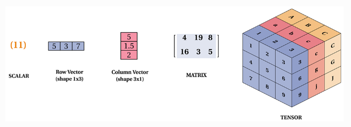

<p align="center">
  <a href="https://www.linkedin.com/in/hasanul-banna-himel/" style="text-decoration:none;">
    
  </a>
   <a href="https://x.com/himel2472" style="text-decoration:none;">
    
  </a>
     <a href="https://www.youtube.com/@hasanulbannahimel7579" style="text-decoration:none;">
    
  </a>
</p>

# **TensorFlow Fundamentals: Your First Steps into Hands-on Deep Learning**

## Overview

An introduction to TensorFlow fundamentals, covering tensor creation, operations, indexing, reshaping, and more.



## Install Dependencies

```bash
pip install -r requirements.txt
```

If you'd like to install TensorFlow with GPU support, make sure to check the official [TensorFlow installation guide](https://www.tensorflow.org/install) for platform-specific instructions.

## Contents

* What are Tensors?
* Tensor Initialization
* Common Tensor Creation Methods
* Tensor Data Types and Casting
* Converting Between NumPy Arrays and Tensors
* Tensor Arithmetic and Comparison Operations
* Matrix Multiplication and Batch Operations
* Broadcasting and Other Useful Operations
* Tensor Indexing
* Tensor Reshaping

## Code Notebook

Explore hands-on examples in this interactive [Jupyter notebook](tensorflow_fundamentals.ipynb).

## Newsletter

Coming Soon

## Blog Post

Coming Soon

## Contributing

Contributions are welcome! To suggest an addition or improvement:

1. Fork the repository
2. Create a feature branch: `git checkout -b feature/TensorFlowTopic`
3. Commit your changes: `git commit -m 'Add some TensorFlowTopic'`
4. Push to your branch: `git push origin feature/TensorFlowTopic`
5. Open a pull request

## License

This project is licensed under the [MIT License](./LICENSE)

---

⭐️ If you find this repository helpful, please consider giving it a star!

## Star History

<a href="https://www.star-history.com/#Hasanul-Banna-Himel/tensorflow_fundamentals&Date">
 <picture>
   <source media="(prefers-color-scheme: dark)" srcset="https://api.star-history.com/svg?repos=Hasanul-Banna-Himel/tensorflow_fundamentals&type=Date&theme=dark" />
   <source media="(prefers-color-scheme: light)" srcset="https://api.star-history.com/svg?repos=Hasanul-Banna-Himel/tensorflow_fundamentals&type=Date" />
   
 </picture>
</a>

> **Keywords**: AI, Machine Learning, Deep Learning, TensorFlow, Generative AI, LLMs, AI Agents

